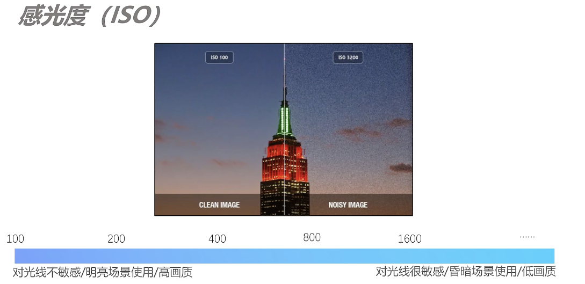
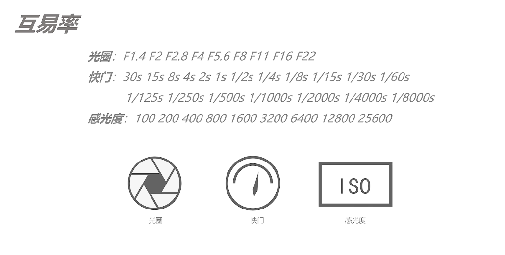

## 基础知识

### 分类

- 微单
- 单反
- 运动相机
- 卡片相机

### 相机配件

- 遮光罩
- 镜头前盖
- 镜身
  - 对焦窗
  - AF 自动对焦
  - MF 手动对焦
  - 防抖
- 变焦环
- 脚架环
- 后盖

#### 变焦镜头

- 大三元
  - 16-200mm
- 小三元
  - 50-200mm
- 其他

#### 定焦镜头

博主推荐

小结

### 专业名词

- 像素
- 宽容度
- 动态范围
- 转接环 (镜头转接环)

相机评判要点

拍摄格式

小结

滤镜

- uv 滤镜
- 反光滤镜
- nd（减光） 滤镜 插片/磁吸

灯光系统

- 闪光灯
- 常亮灯
- 束光灯

### 焦距

透视

- 近大远小
- 一点透视
  
- 两点透视
  
- 三点透视
  
  影响透视的核心因素是距离
  

曝光

曝光三要素

- 光圈
  
- 快门
  
- iso 感光度
  

互易率

曝光补偿

