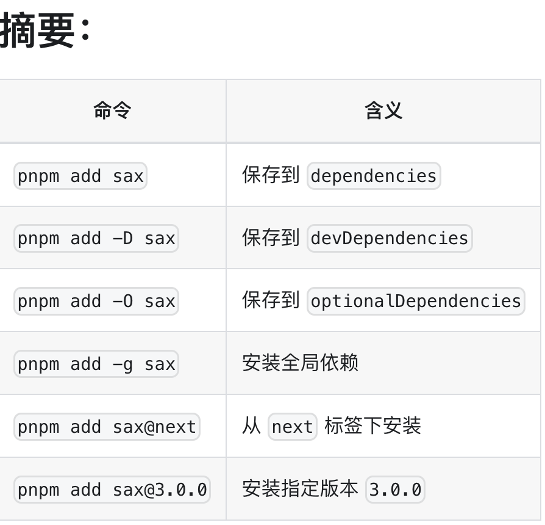
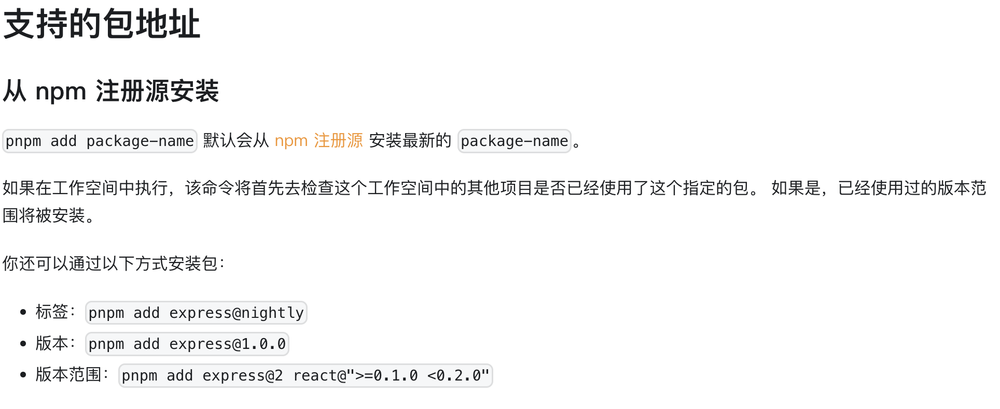
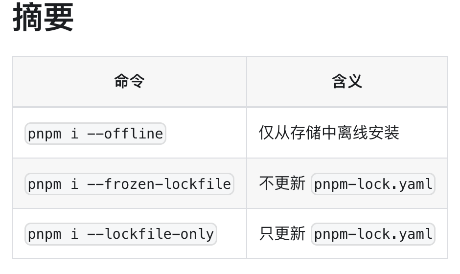
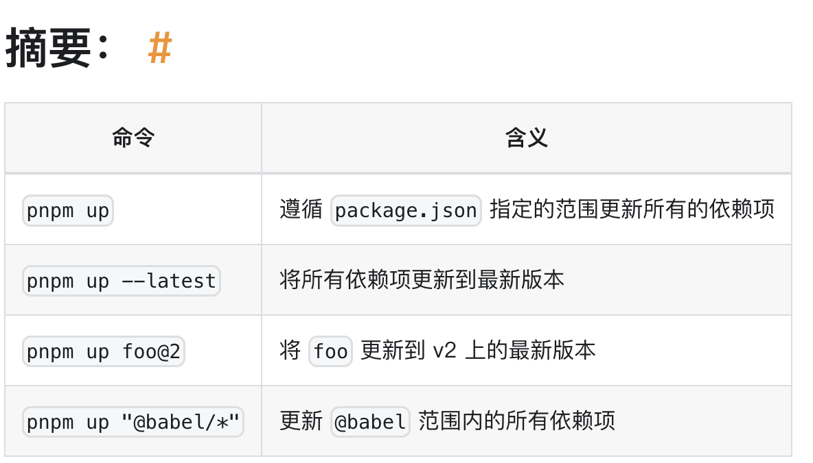

## 命令

```bash
npm install => pnpm install

npm i <pkg> => pnpm add <pkg>


npm run <cmd> => pnpm <cmd>
```

## 过滤

可通过 --filter (或 -F) 标志指定选择器:

```bash
pnpm --filter <package_selector> <command>
```

## 命令



### pnpm add


从 npm 注册源安装
pnpm add package-name 默认会从 npm 注册源 安装最新的 package-name。

如果在工作空间中执行，该命令将首先去检查这个工作空间中的其他项目是否已经使用了这个指定的包。 如果是，已经使用过的版本范围将被安装。

你还可以通过以下方式安装包：

- 标签：pnpm add express@nightly
- 版本：pnpm add express@1.0.0
- 版本范围：pnpm add express@2 react@">=0.1.0 <0.2.0"

从本地文件系统安装

```bash
pnpm add ./package.tar.gz
pnpm add ./some-directory
```

从远程 tarball 中安装

```bash
pnpm add https://github.com/indexzero/forever/tarball/v0.5.6
```

从 Git 存储库安装

```bash
pnpm add <git remote url>
```

### pnpm install

别名: i

pnpm install 用于安装项目所有依赖.

在 CI 环境中, 如果存在锁文件但需要更新，那么安装会失败.

在工作空间内, pnpm install 会在所有项目中安装所有依赖. 如果想禁用这个行为, 将 recursive-install 设置为 false


#### 配置项

##### --force

强制重新安装依赖：重新获取存储中修改的软件包，重新创建由不兼容版本的 pnpm 创建的锁文件和（或）模块目录。 安装所有的可选依赖，即使它们不满足当前环境（cpu、os、arch）。

##### --offline

如果为 true，pnpm 将仅使用存储中已有的包。 如果缓存中没有找不到这个包，那么就会安装失败。

##### --prefer-offline

如果为 true，则会绕过缓存数据的过期性检查，但缺失的数据将从服务器请求。 要强制使用离线模式，使用 --offline

##### --prod, -P

如果被设置，pnpm 将忽略 NODE_ENV 并使用此布尔值来确定环境。

如果 true，pnpm 将不会安装 devDependencies 中列出的任何软件包，并将删除已安装的软件包。 如果 false，pnpm 将安装 devDependencies 和 dependencies 中列出的所有软件包。

##### --dev, -D

仅安装 devDependencies 并删除已安装的 dependencies，无论 NODE_ENV 是什么

##### --no-optional

不安装 `optionalDependencies`。

### pnpm update

别名： up, upgrade

pnpm update 根据指定的范围更新软件包的最新版本。

在不带参数的情况下使用时，将更新所有依赖关系。



```bash
# 更新所有 babel 包:
pnpm update "@babel/*"
# 更新所有依赖项，除了 webpack :
pnpm update "\!webpack"
# 模式也可以组合，因此下一个命令将更新所有 babel 包，除了 core：
pnpm update "@babel/*"  "\!@babel/core"
```

#### --recursive, -r

同时在所有子目录中使用 package.json (不包括 node_modules) 运行更新。

```bash
pnpm --recursive update
# 更新子目录深度为 100 以内的所有包
pnpm --recursive update --depth 100
# 将每个包中的 typescript 更新为最新版本
pnpm --recursive update typescript@latest
```

#### --latest, -L

将依赖项更新至由 latest 标签决定的最新稳定版本（有可能会跨越主版本号），只要 package.json 中指定的版本范围低于 latest 标签的版本号（即不会对预发布版本降级）。

#### --global, -g

更新全局安装的依赖包。

#### --workspace

尝试从工作空间链接所有软件包。 版本将更新至与工作空间内的包匹配的版本。

如果更新了特定的包，而在工作空间内也找不到任何可更新的依赖项，则命令将会失败。 例如，如果 express 不是工作空间内的包，那么以下命令将失败:

```bash
pnpm up -r --workspace express
```

### pnpm remove

别名: rm, uninstall, un

从 node_modules 和项目 package.json 中删除软件包。

#### --recursive, -r

当在 工作空间 中使用此命令时，将从每个工作区的包中移除一个（或多个）依赖。

当不在工作空间内使用时，将在子目录中找到的每个包中删除一个（或多个）依赖。

#### --global, -g

删除全局软件包。

#### --save-dev, -D

仅从 devDependencies 中删除依赖项。

#### --save-optional, -O

仅从 optionalDependencies 中删除依赖项。

#### --save-prod, -P

仅从 dependencies 中删除相关依赖项。

#### --filter <package_selector>

### pnpm link

别名: ln

使当前本地包可在系统范围内或其他位置访问。

```bash
pnpm link <dir|pkg name>
pnpm link
```

#### pnpm link `<dir>`

将 `<dir>` 目录中的软件包链接到执行此命令的软件包的 node_modules 。

例如，如果你在 ~/projects/foo 下，并且执行 pnpm link ../bar，那么将在 foo/node_modules/bar 中创建指向 bar 的链接。

#### pnpm link

将执行此命令的位置的包链接到全局 node_modules，这样它可以通过 pnpm link <pkg> 从另一个包中引用。 此外，如果软件包具有 bin 字段，则软件包的二进制文件将在系统范围内可用。

#### pnpm link `<pkg>`

将指定的软件包 (`<pkg>`) 从全局的 node_modules 链接到执行此命令的软件包的 node_modules。

## 审查选项

### pnpm audit

检查已安装程序包的已知安全问题。

如果发现安全问题，请尝试通过 pnpm update 更新你的依赖项。 如果简单的更新不能解决所有问题，请使用 overrides 来强制使用不易受攻击的版本。 例如，如果 lodash@<2.1.0 易受攻击，可用这个 overrides 来强制使用 lodash@^2.1.0：

```bash
{
    "pnpm": {
        "overrides": {
            "lodash@<2.1.0": "^2.1.0"
        }
    }
}
```

### pnpm list

别名: ls

此命令将以树结构的形式输出已安装的所有软件包的版本以及 及其依赖项。

如果位置参数是 name-pattern@version-range 标识符，会将结果限制为仅名称相符的包。 例如，pnpm list "babel-_" "eslint-_" semver@5。

### pnpm outdated

检查过期的包。 通过提供参数（也支持模式），可以将检查限制在已安装包的子集中

```bash
pnpm outdated
pnpm outdated "*gulp-*" @babel/core
```

### pnpm why

显示依赖于指定包的所有包。

## 配置

### pnpm-workspace.yaml

```bash
packages:
  # 指定根目录直接子目录中的包
  - 'my-app'
  # packages/ 直接子目录中的所有包
  - 'packages/*'
  # components/ 子目录中的所有包
  - 'components/**'
  # 排除测试目录中的包
  - '!**/test/**'
```
