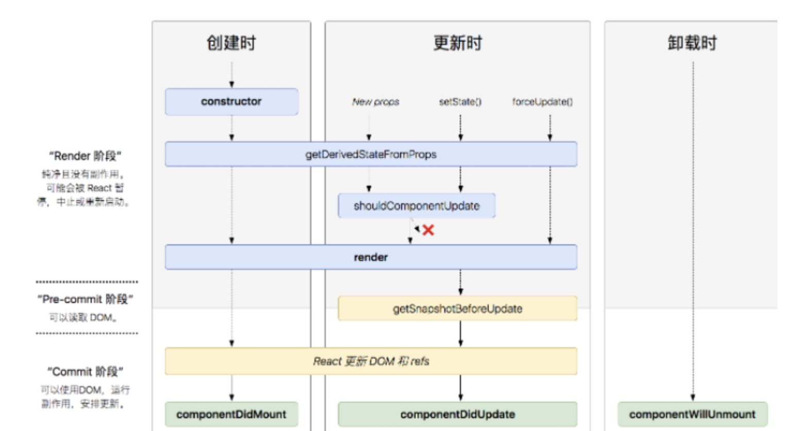

### 是什么

React，用于构建用户界面的 JavaScript 库，只提供了 UI 层面的解决方案

遵循组件设计模式、声明式编程范式和函数式编程概念，以使前端应用程序更高效

使用虚拟 DOM 来有效地操作 DOM，遵循从高阶组件到低阶组件的单向数据流

帮助我们将界面成了各个独立的小块，每一个块就是组件，这些组件之间可以组合、嵌套，构成整体页面

react 类组件使用一个名为 render() 的方法或者函数组件 return，接收输入的数据并返回需要展示的内容

```js
class HelloMessage extends React.Component {
	render() {
		return <div>Hello {this.props.name}</div>;
	}
}

ReactDOM.render(<HelloMessage name="Taylor" />, document.getElementById("hello-example"));
```

上述这种类似 XML 形式就是 JSX，最终会被 babel 编译为合法的 JS 语句调用

被传入的数据可在组件中通过 this.props 在 render() 访问

### 特性

React 特性有很多，如：

- JSX 语法
- 单向数据绑定
- 虚拟 DOM
- 声明式编程
- Component

着重介绍下声明式编程及 Component

### 声明式编程

声明式编程是一种编程范式，它关注的是你要做什么，而不是如何做

它表达逻辑而不显式地定义步骤。这意味着我们需要根据逻辑的计算来声明要显示的组件

如实现一个标记的地图：

通过命令式创建地图、创建标记、以及在地图上添加的标记的步骤如下：

```js
// 创建地图
const map = new Map.map(document.getElementById("map"), {
	zoom: 4,
	center: { lat, lng },
});

// 创建标记
const marker = new Map.marker({
	position: { lat, lng },
	title: "Hello Marker",
});

// 地图上添加标记
marker.setMap(map);
```

而用 React 实现上述功能则如下：

```js
<Map zoom={4} center={(lat, lng)}>
	<Marker position={(lat, lng)} title={"Hello Marker"} />
</Map>
```

声明式编程方式使得 React 组件很容易使用，最终的代码简单易于维护

### Component

在 React 中，一切皆为组件。通常将应用程序的整个逻辑分解为小的单个部分。 我们将每个单独的部分称为组件

组件可以是一个函数或者是一个类，接受数据输入，处理它并返回在 UI 中呈现的 React 元素

函数式组件如下：

```
const Header = () => {
  return (
    <Jumbotron style={{ backgroundColor: "orange" }}>
      <h1>TODO App</h1>
    </Jumbotron>
  );
};
```

类组件（有状态组件）如下：

```js
class Dashboard extends React.Component {
	constructor(props) {
		super(props);

		this.state = {};
	}
	render() {
		return (
			<div className="dashboard">
				<ToDoForm />
				<ToDolist />
			</div>
		);
	}
}
```

一个组件该有的特点如下：

- 可组合：每个组件易于和其它组件一起使用，或者嵌套在另一个组件内部
- 可重用：每个组件都是具有独立功能的，它可以被使用在多个 UI 场景
- 可维护：每个小的组件仅仅包含自身的逻辑，更容易被理解和维护

### 优势

通过上面的初步了解，可以感受到 React 存在的优势：

- 高效灵活
- 声明式的设计，简单使用
- 组件式开发，提高代码复用率
- 单向响应的数据流会比双向绑定的更安全，速度更快

## 说说 Real DOM 和 Virtual DOM 的区别？优缺点？

Real DOM，真实 DOM，意思为文档对象模型，是一个结构化文本的抽象，在页面渲染出的每一个结点都是一个真实 DOM 结构，如下：


Virtual Dom，本质上是以 JavaScript 对象形式存在的对 DOM 的描述

创建虚拟 DOM 目的就是为了更好将虚拟的节点渲染到页面视图中，虚拟 DOM 对象的节点与真实 DOM 的属性一一照应

在 React 中，JSX 是其一大特性，可以让你在 JS 中通过使用 XML 的方式去直接声明界面的 DOM 结构

```js
// 创建 h1 标签，右边千万不能加引号
const vDom = <h1>Hello World</h1>;
// 找到 <div id="root"></div> 节点
const root = document.getElementById("root");
// 把创建的 h1 标签渲染到 root 节点上
ReactDOM.render(vDom, root);
```

上述中，ReactDOM.render() 用于将你创建好的虚拟 DOM 节点插入到某个真实节点上，并渲染到页面上

JSX 实际是一种语法糖，在使用过程中会被 babel 进行编译转化成 JS 代码，上述 VDOM 转化为如下：

```js
const vDom = React.createElement(
  'h1'，
  { className: 'hClass', id: 'hId' },
  'hello world'
)
```

可以看到，JSX 就是为了简化直接调用 React.createElement() 方法：

第一个参数是标签名，例如 h1、span、table...

第二个参数是个对象，里面存着标签的一些属性，例如 id、class 等

第三个参数是节点中的文本

通过 console.log(VDOM)，则能够得到虚拟 VDOM 消息


### 区别

两者的区别如下：

虚拟 DOM 不会进行排版与重绘操作，而真实 DOM 会频繁重排与重绘
虚拟 DOM 的总损耗是“虚拟 DOM 增删改+真实 DOM 差异增删改+排版与重绘”，真实 DOM 的总损耗是“真实 DOM 完全增删改+排版与重绘”

传统的原生 api 或 jQuery 去操作 DOM 时，浏览器会从构建 DOM 树开始从头到尾执行一遍流程

当你在一次操作时，需要更新 10 个 DOM 节点，浏览器没这么智能，收到第一个更新 DOM 请求后，并不知道后续还有 9 次更新操作，因此会马上执行流程，最终执行 10 次流程

而通过 VNode，同样更新 10 个 DOM 节点，虚拟 DOM 不会立即操作 DOM，而是将这 10 次更新的 diff 内容保存到本地的一个 js 对象中，最终将这个 js 对象一次性 attach 到 DOM 树上，避免大量的无谓计算

### 优缺点

真实 DOM 的优势：

- 易用
  缺点：

- 效率低，解析速度慢，内存占用量过高
- 性能差：频繁操作真实 DOM，易于导致重绘与回流
  使用虚拟 DOM 的优势如下：

- 简单方便：如果使用手动操作真实 DOM 来完成页面，繁琐又容易出错，在大规模应用下维护起来也很困难

- 性能方面：使用 Virtual DOM，能够有效避免真实 DOM 数频繁更新，减少多次引起重绘与回流，提高性能

- 跨平台：React 借助虚拟 DOM，带来了跨平台的能力，一套代码多端运行

缺点：

- 在一些性能要求极高的应用中虚拟 DOM 无法进行针对性的极致优化
- 首次渲染大量 DOM 时，由于多了一层虚拟 DOM 的计算，速度比正常稍慢

## 生命周期

这里主要讲述react16.4之后的生命周期，可以分成三个阶段
- 创建阶段
- 更新阶段
- 卸载阶段

### 创建阶段

创建阶段主要分成了以下几个生命周期方法：

- constructor
- getDerivedStateFromProps
- render
- componentDidMount

#### constructor
实例过程中自动调用的方法，在方法内部通过super关键字获取来自父组件的props

在该方法中，通常的操作为初始化state状态或者在this上挂载方法

#### getDerivedStateFromProps

该方法是新增的生命周期方法，是一个静态的方法，因此不能访问到组件的实例

执行时机：组件创建和更新阶段，不论是props变化还是state变化，都会调用

在每次render方法前调用，第一个参数为即将更新的props，第二个参数为上一个状态的state，可以比较props 和 state来加一些限制条件，防止无用的state更新

该方法需要返回一个新的对象作为新的state或者返回null表示state状态不需要更新

#### render
类组件必须实现的方法，用于渲染DOM结构，可以访问组件state与prop属性
:::tip
注意： 不要在 render 里面 setState, 否则会触发死循环导致内存崩溃
:::
#### componentDidMount

组件挂载到真实DOM节点后执行，其在render方法之后执行

此方法多用于执行一些数据获取，事件监听等操作

### 更新阶段
该阶段的函数主要为如下方法：

- getDerivedStateFromProps
- shouldComponentUpdate
- render
- getSnapshotBeforeUpdate
- componentDidUpdate

#### shouldComponentUpdate

用于告知组件本身基于当前的props和state是否需要重新渲染组件，默认情况返回true

执行时机：到新的props或者state时都会调用，通过返回true或者false告知组件更新与否

一般情况，不建议在该周期方法中进行深层比较，会影响效率

同时也不能调用setState，否则会导致无限循环调用更新
#### getSnapshotBeforeUpdate
该周期函数在render后执行，执行之时DOM元素还没有被更新

该方法返回的一个Snapshot值，作为componentDidUpdate第三个参数传入
```js
getSnapshotBeforeUpdate(prevProps, prevState) {
    console.log('#enter getSnapshotBeforeUpdate');
    return 'foo';
}

componentDidUpdate(prevProps, prevState, snapshot) {
    console.log('#enter componentDidUpdate snapshot = ', snapshot);
}
```
此方法的目的在于获取组件更新前的一些信息，比如组件的滚动位置之类的，在组件更新后可以根据这些信息恢复一些UI视觉上的状态

#### componentDidUpdate
执行时机：组件更新结束后触发

在该方法中，可以根据前后的props和state的变化做相应的操作，如获取数据，修改DOM样式等

### 卸载阶段

#### componentWillUnmount

此方法用于组件卸载前，清理一些注册是监听事件，或者取消订阅的网络请求等

一旦一个组件实例被卸载，其不会被再次挂载，而只可能是被重新创建

### 总结
新版生命周期整体流程如下图所示：



旧的生命周期流程图如下


通过两个图的对比，可以发现新版的生命周期减少了以下三种方法：
- componentWillMount
- componentWillReceiveProps
- componentWillUpdate

其实这三个方法仍然存在，只是在前者加上了UNSAFE_前缀，如UNSAFE_componentWillMount，并不像字面意思那样表示不安全，而是表示这些生命周期的代码可能在未来的 react版本可能废除

同时也新增了两个生命周期函数：

- getDerivedStateFromProps
- getSnapshotBeforeUpdate

state 和 props 有什么区别

## 说说你对immutable的理解
