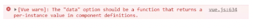

## vue-show 与 v-if 的理解

### v-show 与 v-if 的区别

- 控制手段不同
- 编译过程不同
- 编译条件不同

控制手段：v-show 隐藏则是为该元素添加 css--display:none，dom 元素依旧还在。v-if 显示隐藏是将 dom 元素整个添加或删除

编译过程：v-if 切换有一个局部编译/卸载的过程，切换过程中合适地销毁和重建内部的事件监听和子组件；v-show 只是简单的基于 css 切换

编译条件：v-if 是真正的条件渲染，它会确保在切换过程中条件块内的事件监听器和子组件适当地被销毁和重建。只有渲染条件为假时，并不做操作，直到为真才渲染

- v-show 由 false 变为 true 的时候不会触发组件的生命周期

- v-if 由 false 变为 true 的时候，触发组件的 beforeCreate、create、beforeMount、mounted 钩子，由 true 变为 false 的时候触发组件的 beforeDestory、destoryed 方法

性能消耗：v-if 有更高的切换消耗；v-show 有更高的初始渲染消耗；

### v-show 与 v-if 原理分析

- 将模板 template 转为 ast 结构的 JS 对象
- 用 ast 得到的 JS 对象拼装 render 和 staticRenderFns 函数
  render 和 staticRenderFns 函数被调用后生成虚拟 VNODE 节点，该节点包含创建 DOM 节点所需信息
- vm.patch 函数通过虚拟 DOM 算法利用 VNODE 节点创建真实 DOM 节点

#### v-show 原理

不管初始条件是什么，元素总是会被渲染

我们看一下在 vue 中是如何实现的

代码很好理解，有 transition 就执行 transition，没有就直接设置 display 属性

```js
// https://github.com/vuejs/vue-next/blob/3cd30c5245da0733f9eb6f29d220f39c46518162/packages/runtime-dom/src/directives/vShow.ts
export const vShow: ObjectDirective<VShowElement> = {
	beforeMount(el, { value }, { transition }) {
		el._vod = el.style.display === "none" ? "" : el.style.display;
		if (transition && value) {
			transition.beforeEnter(el);
		} else {
			setDisplay(el, value);
		}
	},
	mounted(el, { value }, { transition }) {
		if (transition && value) {
			transition.enter(el);
		}
	},
	updated(el, { value, oldValue }, { transition }) {
		// ...
	},
	beforeUnmount(el, { value }) {
		setDisplay(el, value);
	},
};
```

#### v-if 原理

v-if 在实现上比 v-show 要复杂的多，因为还有 else else-if 等条件需要处理，这里我们也只摘抄源码中处理 v-if 的一小部分

返回一个 node 节点，render 函数通过表达式的值来决定是否生成 DOM

```js
// https://github.com/vuejs/vue-next/blob/cdc9f336fd/packages/compiler-core/src/transforms/vIf.ts
export const transformIf = createStructuralDirectiveTransform(
  /^(if|else|else-if)$/,
  (node, dir, context) => {
    return processIf(node, dir, context, (ifNode, branch, isRoot) => {
      // ...
      return () => {
        if (isRoot) {
          ifNode.codegenNode = createCodegenNodeForBranch(
            branch,
            key,
            context
          ) as IfConditionalExpression
        } else {
          // attach this branch's codegen node to the v-if root.
          const parentCondition = getParentCondition(ifNode.codegenNode!)
          parentCondition.alternate = createCodegenNodeForBranch(
            branch,
            key + ifNode.branches.length - 1,
            context
          )
        }
      }
    })
  }
)
```

#### v-show 与 v-if 的使用场景

v-if 与 v-show 都能控制 dom 元素在页面的显示

v-if 相比 v-show 开销更大的（直接操作 dom 节点增加与删除）

如果需要非常频繁地切换，则使用 v-show 较好

如果在运行时条件很少改变，则使用 v-if 较好

## Vue 实例挂载的过程

### 思考

我们都听过知其然知其所以然这句话

那么不知道大家是否思考过 new Vue()这个过程中究竟做了些什么？

过程中是如何完成数据的绑定，又是如何将数据渲染到视图的等等

### 分析

首先找到 vue 的构造函数

源码位置：src\core\instance\index.js

```js
function Vue(options) {
	if (process.env.NODE_ENV !== "production" && !(this instanceof Vue)) {
		warn("Vue is a constructor and should be called with the `new` keyword");
	}
	this._init(options);
}
```

options 是用户传递过来的配置项，如 data、methods 等常用的方法

vue 构建函数调用\_init 方法，但我们发现本文件中并没有此方法，但仔细可以看到文件下方定定义了很多初始化方法

```js
initMixin(Vue); // 定义 _init
stateMixin(Vue); // 定义 $set $get $delete $watch 等
eventsMixin(Vue); // 定义事件  $on  $once $off $emit
lifecycleMixin(Vue); // 定义 _update  $forceUpdate  $destroy
renderMixin(Vue); // 定义 _render 返回虚拟dom
```

首先可以看 initMixin 方法，发现该方法在 Vue 原型上定义了\_init 方法

源码位置：src\core\instance\init.js

```js
Vue.prototype._init = function (options?: Object) {
	const vm: Component = this;
	// a uid
	vm._uid = uid++;
	let startTag, endTag;
	/* istanbul ignore if */
	if (process.env.NODE_ENV !== "production" && config.performance && mark) {
		startTag = `vue-perf-start:${vm._uid}`;
		endTag = `vue-perf-end:${vm._uid}`;
		mark(startTag);
	}

	// a flag to avoid this being observed
	vm._isVue = true;
	// merge options
	// 合并属性，判断初始化的是否是组件，这里合并主要是 mixins 或 extends 的方法
	if (options && options._isComponent) {
		// optimize internal component instantiation
		// since dynamic options merging is pretty slow, and none of the
		// internal component options needs special treatment.
		initInternalComponent(vm, options);
	} else {
		// 合并vue属性
		vm.$options = mergeOptions(resolveConstructorOptions(vm.constructor), options || {}, vm);
	}
	/* istanbul ignore else */
	if (process.env.NODE_ENV !== "production") {
		// 初始化proxy拦截器
		initProxy(vm);
	} else {
		vm._renderProxy = vm;
	}
	// expose real self
	vm._self = vm;
	// 初始化组件生命周期标志位
	initLifecycle(vm);
	// 初始化组件事件侦听
	initEvents(vm);
	// 初始化渲染方法
	initRender(vm);
	callHook(vm, "beforeCreate");
	// 初始化依赖注入内容，在初始化data、props之前
	initInjections(vm); // resolve injections before data/props
	// 初始化props/data/method/watch/methods
	initState(vm);
	initProvide(vm); // resolve provide after data/props
	callHook(vm, "created");

	/* istanbul ignore if */
	if (process.env.NODE_ENV !== "production" && config.performance && mark) {
		vm._name = formatComponentName(vm, false);
		mark(endTag);
		measure(`vue ${vm._name} init`, startTag, endTag);
	}
	// 挂载元素
	if (vm.$options.el) {
		vm.$mount(vm.$options.el);
	}
};
```

仔细阅读上面的代码，我们得到以下结论：

- 在调用 beforeCreate 之前，数据初始化并未完成，像 data、props 这些属性无法访问到

- 到了 created 的时候，数据已经初始化完成，能够访问 data、props 这些属性，但这时候并未完成 dom 的挂载，因此无法访问到 dom 元素

- 挂载方法是调用 vm.$mount 方法

initState 方法是完成 props/data/method/watch/methods 的初始化

源码位置：src\core\instance\state.js

```js
export function initState(vm: Component) {
	// 初始化组件的watcher列表
	vm._watchers = [];
	const opts = vm.$options;
	// 初始化props
	if (opts.props) initProps(vm, opts.props);
	// 初始化methods方法
	if (opts.methods) initMethods(vm, opts.methods);
	if (opts.data) {
		// 初始化data
		initData(vm);
	} else {
		observe((vm._data = {}), true /* asRootData */);
	}
	if (opts.computed) initComputed(vm, opts.computed);
	if (opts.watch && opts.watch !== nativeWatch) {
		initWatch(vm, opts.watch);
	}
}
```

我们和这里主要看初始化 data 的方法为 initData，它与 initState 在同一文件上

```js
function initData(vm: Component) {
	let data = vm.$options.data;
	// 获取到组件上的data
	data = vm._data = typeof data === "function" ? getData(data, vm) : data || {};
	if (!isPlainObject(data)) {
		data = {};
		process.env.NODE_ENV !== "production" && warn("data functions should return an object:\n" + "https://vuejs.org/v2/guide/components.html#data-Must-Be-a-Function", vm);
	}
	// proxy data on instance
	const keys = Object.keys(data);
	const props = vm.$options.props;
	const methods = vm.$options.methods;
	let i = keys.length;
	while (i--) {
		const key = keys[i];
		if (process.env.NODE_ENV !== "production") {
			// 属性名不能与方法名重复
			if (methods && hasOwn(methods, key)) {
				warn(`Method "${key}" has already been defined as a data property.`, vm);
			}
		}
		// 属性名不能与state名称重复
		if (props && hasOwn(props, key)) {
			process.env.NODE_ENV !== "production" && warn(`The data property "${key}" is already declared as a prop. ` + `Use prop default value instead.`, vm);
		} else if (!isReserved(key)) {
			// 验证key值的合法性
			// 将_data中的数据挂载到组件vm上,这样就可以通过this.xxx访问到组件上的数据
			proxy(vm, `_data`, key);
		}
	}
	// observe data
	// 响应式监听data是数据的变化
	observe(data, true /* asRootData */);
}
```

仔细阅读上面的代码，我们可以得到以下结论：

初始化顺序：props、methods、data

data 定义的时候可选择函数形式或者对象形式（组件只能为函数形式）

关于数据响应式在这就不展开详细说明

上文提到挂载方法是调用 vm.$mount 方法

```js
Vue.prototype.$mount = function (el?: string | Element, hydrating?: boolean): Component {
	// 获取或查询元素
	el = el && query(el);

	/* istanbul ignore if */
	// vue 不允许直接挂载到body或页面文档上
	if (el === document.body || el === document.documentElement) {
		process.env.NODE_ENV !== "production" && warn(`Do not mount Vue to <html> or <body> - mount to normal elements instead.`);
		return this;
	}

	const options = this.$options;
	// resolve template/el and convert to render function
	if (!options.render) {
		let template = options.template;
		// 存在template模板，解析vue模板文件
		if (template) {
			if (typeof template === "string") {
				if (template.charAt(0) === "#") {
					template = idToTemplate(template);
					/* istanbul ignore if */
					if (process.env.NODE_ENV !== "production" && !template) {
						warn(`Template element not found or is empty: ${options.template}`, this);
					}
				}
			} else if (template.nodeType) {
				template = template.innerHTML;
			} else {
				if (process.env.NODE_ENV !== "production") {
					warn("invalid template option:" + template, this);
				}
				return this;
			}
		} else if (el) {
			// 通过选择器获取元素内容
			template = getOuterHTML(el);
		}
		if (template) {
			/* istanbul ignore if */
			if (process.env.NODE_ENV !== "production" && config.performance && mark) {
				mark("compile");
			}
			/**
			 *  1.将temmplate解析ast tree
			 *  2.将ast tree转换成render语法字符串
			 *  3.生成render方法
			 */
			const { render, staticRenderFns } = compileToFunctions(
				template,
				{
					outputSourceRange: process.env.NODE_ENV !== "production",
					shouldDecodeNewlines,
					shouldDecodeNewlinesForHref,
					delimiters: options.delimiters,
					comments: options.comments,
				},
				this
			);
			options.render = render;
			options.staticRenderFns = staticRenderFns;

			/* istanbul ignore if */
			if (process.env.NODE_ENV !== "production" && config.performance && mark) {
				mark("compile end");
				measure(`vue ${this._name} compile`, "compile", "compile end");
			}
		}
	}
	return mount.call(this, el, hydrating);
};
```

阅读上面代码，我们能得到以下结论：

不要将根元素放到 body 或者 html 上

可以在对象中定义 template/render 或者直接使用 template、el 表示元素选择器

最终都会解析成 render 函数，调用 compileToFunctions，会将 template 解析成 render 函数

对 template 的解析步骤大致分为以下几步：

将 html 文档片段解析成 ast 描述符

将 ast 描述符解析成字符串

生成 render 函数

生成 render 函数，挂载到 vm 上后，会再次调用 mount 方法

源码位置：src\platforms\web\runtime\index.js

```js
Vue.prototype.$mount = function (el?: string | Element, hydrating?: boolean): Component {
	el = el && inBrowser ? query(el) : undefined;
	// 渲染组件
	return mountComponent(this, el, hydrating);
};
```

调用 mountComponent 渲染组件

```js
export function mountComponent(vm: Component, el: ?Element, hydrating?: boolean): Component {
	vm.$el = el;
	// 如果没有获取解析的render函数，则会抛出警告
	// render是解析模板文件生成的
	if (!vm.$options.render) {
		vm.$options.render = createEmptyVNode;
		if (process.env.NODE_ENV !== "production") {
			/* istanbul ignore if */
			if ((vm.$options.template && vm.$options.template.charAt(0) !== "#") || vm.$options.el || el) {
				warn(
					"You are using the runtime-only build of Vue where the template " +
						"compiler is not available. Either pre-compile the templates into " +
						"render functions, or use the compiler-included build.",
					vm
				);
			} else {
				// 没有获取到vue的模板文件
				warn("Failed to mount component: template or render function not defined.", vm);
			}
		}
	}
	// 执行beforeMount钩子
	callHook(vm, "beforeMount");

	let updateComponent;
	/* istanbul ignore if */
	if (process.env.NODE_ENV !== "production" && config.performance && mark) {
		updateComponent = () => {
			const name = vm._name;
			const id = vm._uid;
			const startTag = `vue-perf-start:${id}`;
			const endTag = `vue-perf-end:${id}`;

			mark(startTag);
			const vnode = vm._render();
			mark(endTag);
			measure(`vue ${name} render`, startTag, endTag);

			mark(startTag);
			vm._update(vnode, hydrating);
			mark(endTag);
			measure(`vue ${name} patch`, startTag, endTag);
		};
	} else {
		// 定义更新函数
		updateComponent = () => {
			// 实际调⽤是在lifeCycleMixin中定义的_update和renderMixin中定义的_render
			vm._update(vm._render(), hydrating);
		};
	}
	// we set this to vm._watcher inside the watcher's constructor
	// since the watcher's initial patch may call $forceUpdate (e.g. inside child
	// component's mounted hook), which relies on vm._watcher being already defined
	// 监听当前组件状态，当有数据变化时，更新组件
	new Watcher(
		vm,
		updateComponent,
		noop,
		{
			before() {
				if (vm._isMounted && !vm._isDestroyed) {
					// 数据更新引发的组件更新
					callHook(vm, "beforeUpdate");
				}
			},
		},
		true /* isRenderWatcher */
	);
	hydrating = false;

	// manually mounted instance, call mounted on self
	// mounted is called for render-created child components in its inserted hook
	if (vm.$vnode == null) {
		vm._isMounted = true;
		callHook(vm, "mounted");
	}
	return vm;
}
```

阅读上面代码，我们得到以下结论：

会触发 beforeCreate 钩子
定义 updateComponent 渲染页面视图的方法
监听组件数据，一旦发生变化，触发 beforeUpdate 生命钩子
updateComponent 方法主要执行在 vue 初始化时声明的 render，update 方法

render 的作用主要是生成 vnode

源码位置：src\core\instance\render.js

```js
// 定义vue 原型上的render方法
Vue.prototype._render = function (): VNode {
	const vm: Component = this;
	// render函数来自于组件的option
	const { render, _parentVnode } = vm.$options;

	if (_parentVnode) {
		vm.$scopedSlots = normalizeScopedSlots(_parentVnode.data.scopedSlots, vm.$slots, vm.$scopedSlots);
	}

	// set parent vnode. this allows render functions to have access
	// to the data on the placeholder node.
	vm.$vnode = _parentVnode;
	// render self
	let vnode;
	try {
		// There's no need to maintain a stack because all render fns are called
		// separately from one another. Nested component's render fns are called
		// when parent component is patched.
		currentRenderingInstance = vm;
		// 调用render方法，自己的独特的render方法， 传入createElement参数，生成vNode
		vnode = render.call(vm._renderProxy, vm.$createElement);
	} catch (e) {
		handleError(e, vm, `render`);
		// return error render result,
		// or previous vnode to prevent render error causing blank component
		/* istanbul ignore else */
		if (process.env.NODE_ENV !== "production" && vm.$options.renderError) {
			try {
				vnode = vm.$options.renderError.call(vm._renderProxy, vm.$createElement, e);
			} catch (e) {
				handleError(e, vm, `renderError`);
				vnode = vm._vnode;
			}
		} else {
			vnode = vm._vnode;
		}
	} finally {
		currentRenderingInstance = null;
	}
	// if the returned array contains only a single node, allow it
	if (Array.isArray(vnode) && vnode.length === 1) {
		vnode = vnode[0];
	}
	// return empty vnode in case the render function errored out
	if (!(vnode instanceof VNode)) {
		if (process.env.NODE_ENV !== "production" && Array.isArray(vnode)) {
			warn("Multiple root nodes returned from render function. Render function " + "should return a single root node.", vm);
		}
		vnode = createEmptyVNode();
	}
	// set parent
	vnode.parent = _parentVnode;
	return vnode;
};
```

\_update 主要功能是调用 patch，将 vnode 转换为真实 DOM，并且更新到页面中

源码位置：src\core\instance\lifecycle.js

```js
Vue.prototype._update = function (vnode: VNode, hydrating?: boolean) {
	const vm: Component = this;
	const prevEl = vm.$el;
	const prevVnode = vm._vnode;
	// 设置当前激活的作用域
	const restoreActiveInstance = setActiveInstance(vm);
	vm._vnode = vnode;
	// Vue.prototype.__patch__ is injected in entry points
	// based on the rendering backend used.
	if (!prevVnode) {
		// initial render
		// 执行具体的挂载逻辑
		vm.$el = vm.__patch__(vm.$el, vnode, hydrating, false /* removeOnly */);
	} else {
		// updates
		vm.$el = vm.__patch__(prevVnode, vnode);
	}
	restoreActiveInstance();
	// update __vue__ reference
	if (prevEl) {
		prevEl.__vue__ = null;
	}
	if (vm.$el) {
		vm.$el.__vue__ = vm;
	}
	// if parent is an HOC, update its $el as well
	if (vm.$vnode && vm.$parent && vm.$vnode === vm.$parent._vnode) {
		vm.$parent.$el = vm.$el;
	}
	// updated hook is called by the scheduler to ensure that children are
	// updated in a parent's updated hook.
};
```

### 结论

1. new Vue 的时候调用会调用\_init 方法

- 定义 $set、$get 、$delete、$watch 等方法
- 定义 $on、$off、$emit、$off 等事件
- 定义 \_update、$forceUpdate、$destroy 生命周期

2. 调用$mount 进行页面的挂载

3. 挂载的时候主要是通过 mountComponent 方法

4. 定义 updateComponent 更新函数

5. 执行 render 生成虚拟 DOM

6. \_update 将虚拟 DOM 生成真实 DOM 结构，并且渲染到页面中

## vue 生命周期

生命周期（Life Cycle）的概念应用很广泛，特别是在政治、经济、环境、技术、社会等诸多领域经常出现，其基本涵义可以通俗地理解为“从摇篮到坟墓”（Cradle-to-Grave）的整个过程在 Vue 中实例从创建到销毁的过程就是生命周期，即指从创建、初始化数据、编译模板、挂载 Dom→ 渲染、更新 → 渲染、卸载等一系列过程我们可以把组件比喻成工厂里面的一条流水线，每个工人（生命周期）站在各自的岗位，当任务流转到工人身边的时候，工人就开始工作 PS：在 Vue 生命周期钩子会自动绑定 this 上下文到实例中，因此你可以访问数据，对 property 和方法进行运算这意味着你不能使用箭头函数来定义一个生命周期方法 (例如 `created: () => this.fetchTodos())`

Vue 生命周期总共可以分为 8 个阶段：创建前后, 载入前后,更新前后,销毁前销毁后，以及一些特殊场景的生命周期


#### beforeCreate -> created

初始化 vue 实例，进行数据观测

#### created

- 完成数据观测，属性与方法的运算，watch、event 事件回调的配置
- 可调用 methods 中的方法，访问和修改 data 数据触发响应式渲染 dom，可通过 computed 和 watch 完成数据计算
- 此时 vm.$el 并没有被创建

#### created -> beforeMount

- 判断是否存在 el 选项，若不存在则停止编译，直到调用 vm.$mount(el)才会继续编译
- 优先级：render > template > outerHTML
- vm.el 获取到的是挂载 DOM 的

#### beforeMount

- 在此阶段可获取到 vm.el
- 此阶段 vm.el 虽已完成 DOM 初始化，但并未挂载在 el 选项上

#### beforeMount -> mounted

- 此阶段 vm.el 完成挂载，vm.$el 生成的 DOM 替换了 el 选项所对应的 DOM

#### mounted

- vm.el 已完成 DOM 的挂载与渲染，此刻打印 vm.$el，发现之前的挂载点及内容已被替换成新的 DOM

#### beforeUpdate

- 更新的数据必须是被渲染在模板上的（el、template、render 之一）
- 此时 view 层还未更新
- 若在 beforeUpdate 中再次修改数据，不会再次触发更新方法

#### updated

-完成 view 层的更新

- 若在 updated 中再次修改数据，会再次触发更新方法（beforeUpdate、updated)

#### beforeDestroy

- 实例被销毁前调用，此时实例属性与方法仍可访问

#### destroyed

- 完全销毁一个实例。可清理它与其它实例的连接，解绑它的全部指令及事件监听器 -并不能清除 DOM，仅仅销毁实例

#### 使用场景分析


#### 数据请求在 created 和 mouted 的区别

created 是在组件实例一旦创建完成的时候立刻调用，这时候页面 dom 节点并未生成；mounted 是在页面 dom 节点渲染完毕之后就立刻执行的。触发时机上 created 是比 mounted 要更早的，两者的相同点：都能拿到实例对象的属性和方法。 讨论这个问题本质就是触发的时机，放在 mounted 中的请求有可能导致页面闪动（因为此时页面 dom 结构已经生成），但如果在页面加载前完成请求，则不会出现此情况。建议对页面内容的改动放在 created 生命周期当中。

## v-if 和 v-for 的优先级是什么？


v-if 指令用于条件性地渲染一块内容。这块内容只会在指令的表达式返回 true 值的时候被渲染

v-for 指令基于一个数组来渲染一个列表。v-for 指令需要使用 item in items 形式的特殊语法，其中 items 是源数据数组或者对象，而 item 则是被迭代的数组元素的别名

在 v-for 的时候，建议设置 key 值，并且保证每个 key 值是独一无二的，这便于 diff 算法进行优化

```js
<Modal v-if="isShow" />

<li v-for="item in items" :key="item.id">
    {{ item.label }}
</li>
```

vue 源码

```js
export function genElement (el: ASTElement, state: CodegenState): string {
  if (el.parent) {
    el.pre = el.pre || el.parent.pre
  }
  if (el.staticRoot && !el.staticProcessed) {
    return genStatic(el, state)
  } else if (el.once && !el.onceProcessed) {
    return genOnce(el, state)
  } else if (el.for && !el.forProcessed) {
    return genFor(el, state)
  } else if (el.if && !el.ifProcessed) {
    return genIf(el, state)
  } else if (el.tag === 'template' && !el.slotTarget && !state.pre) {
    return genChildren(el, state) || 'void 0'
  } else if (el.tag === 'slot') {
    return genSlot(el, state)
  } else {
    // component or element
    ...
}
```

在进行 if 判断的时候，v-for 是比 v-if 先进行判断

最终结论：v-for 优先级比 v-if 高

1. 永远不要把 v-if 和 v-for 同时用在同一个元素上，带来性能方面的浪费（每次渲染都会先循环再进行条件判断）
2. 如果避免出现这种情况，则在外层嵌套 template（页面渲染不生成 dom 节点），在这一层进行 v-if 判断，然后在内部进行 v-for 循环

```html
<template v-if="isShow"> <p v-for="item in items"></p></template>
```

3. 如果条件出现在循环内部，可通过计算属性 computed 提前过滤掉那些不需要显示的项

```js
computed: {
    items: function() {
      return this.list.filter(function (item) {
        return item.isShow
      })
    }
}
```

## SPA 首屏加载速度慢的怎么解决？

### 什么是首屏加载

首屏时间（First Contentful Paint），指的是浏览器从响应用户输入网址地址，到首屏内容渲染完成的时间，此时整个网页不一定要全部渲染完成，但需要展示当前视窗需要的内容

通过 DOMContentLoad 或者 performance 来计算出首屏时间

```js
// 方案一：
document.addEventListener('DOMContentLoaded', (event) => {
    console.log('first contentful painting');
});
// 方案二：
performance.getEntriesByName("first-contentful-paint")[0].startTime

// performance.getEntriesByName("first-contentful-paint")[0]
// 会返回一个 PerformancePaintTiming的实例，结构如下：
{
  name: "first-contentful-paint",
  entryType: "paint",
  startTime: 507.80000002123415,
  duration: 0,
};
```

### 加载慢的原因

在页面渲染的过程，导致加载速度慢的因素可能如下：

- 网络延时问题
- 资源文件体积是否过大
- 资源是否重复发送请求去加载了
- 加载脚本的时候，渲染内容堵塞了

### 解决方案

常见的几种 SPA 首屏优化方式

- 减小入口文件积
- 静态资源本地缓存
- UI 框架按需加载
- 图片资源的压缩
- 组件重复打包
- 开启 GZip 压缩
- 使用 SSR

#### 减小入口文件体积

常用的手段是路由懒加载，把不同路由对应的组件分割成不同的代码块，待路由被请求的时候会单独打包路由，使得入口文件变小，加载速度大大增加

在 vue-router 配置路由的时候，采用动态加载路由的形式

```js
routes:[
    path: 'Blogs',
    name: 'ShowBlogs',
    component: () => import('./components/ShowBlogs.vue')
]
```

以函数的形式加载路由，这样就可以把各自的路由文件分别打包，只有在解析给定的路由时，才会加载路由组件

#### 静态资源本地缓存

后端返回资源问题：

- 采用 HTTP 缓存，设置 Cache-Control，Last-Modified，Etag 等响应头

- 采用 Service Worker 离线缓存

前端合理利用 localStorage

#### UI 框架按需加载

在日常使用 UI 框架，例如 element-UI、或者 antd，我们经常性直接引用整个 UI 库

```js
import ElementUI from "element-ui";
Vue.use(ElementUI);
```

但实际上我用到的组件只有按钮，分页，表格，输入与警告 所以我们要按需引用

```js
import { Button, Input, Pagination, Table, TableColumn, MessageBox } from "element-ui";
Vue.use(Button);
Vue.use(Input);
Vue.use(Pagination);
```

#### 组件重复打包

假设 A.js 文件是一个常用的库，现在有多个路由使用了 A.js 文件，这就造成了重复下载

解决方案：在 webpack 的 config 文件中，修改 CommonsChunkPlugin 的配置

```js
minChunks: 3;
```

minChunks 为 3 表示会把使用 3 次及以上的包抽离出来，放进公共依赖文件，避免了重复加载组件

#### 图片资源的压缩

图片资源虽然不在编码过程中，但它却是对页面性能影响最大的因素

对于所有的图片资源，我们可以进行适当的压缩

对页面上使用到的 icon，可以使用在线字体图标，或者雪碧图，将众多小图标合并到同一张图上，用以减轻 http 请求压力。

#### 开启 GZip 压缩

拆完包之后，我们再用 gzip 做一下压缩 安装 compression-webpack-plugin

```js
cnmp i compression-webpack-plugin -D
```

在 vue.congig.js 中引入并修改 webpack 配置

```js
const CompressionPlugin = require("compression-webpack-plugin");

configureWebpack: (config) => {
	if (process.env.NODE_ENV === "production") {
		// 为生产环境修改配置...
		config.mode = "production";
		return {
			plugins: [
				new CompressionPlugin({
					test: /\.js$|\.html$|\.css/, //匹配文件名
					threshold: 10240, //对超过10k的数据进行压缩
					deleteOriginalAssets: false, //是否删除原文件
				}),
			],
		};
	}
};
```

在服务器我们也要做相应的配置 如果发送请求的浏览器支持 gzip，就发送给它 gzip 格式的文件 我的服务器是用 express 框架搭建的 只要安装一下 compression 就能使用

```js
// express
const compression = require('compression')
app.use(compression())  // 在其他中间件使用之前调用

// nginx
// 安装gzip
nginx -V 2>&1 | grep gzip

// 在http 添加gzip配置
gzip on; //开启 Gzip 压缩
gzip_comp_level 6; //设置压缩级别，值越大压缩效果越好，但处理速度也越慢
gzip_min_length 256; //设置允许压缩的最小文件大小
gzip_proxied any; //设置哪些请求可以被代理压缩
gzip_types text/plain text/css application/javascript;//设置允许压缩的内容类型
```

#### 使用 SSR

SSR（Server side ），也就是服务端渲染，组件或页面通过服务器生成 html 字符串，再发送到浏览器

从头搭建一个服务端渲染是很复杂的，vue 应用建议使用 Nuxt.js 实现服务端渲染

#### 小结

减少首屏渲染时间的方法有很多，总的来讲可以分成两大部分 ：资源加载优化 和 页面渲染优化

下图是更为全面的首屏优化的方案


## 为什么 data 属性是一个函数而不是一个对象？

### 实例和组件定义 data 的区别

vue 实例的时候定义 data 属性既可以是一个对象，也可以是一个函数

```js
const app = new Vue({
	el: "#app",
	// 对象格式
	data: {
		foo: "foo",
	},
	// 函数格式
	data() {
		return {
			foo: "foo",
		};
	},
});
```

组件中定义 data 属性，只能是一个函数

如果为组件 data 直接定义为一个对象

```js
Vue.component("component1", {
	template: `<div>组件</div>`,
	data: {
		foo: "foo",
	},
});
```

则会得到警告信息



警告说明：返回的 data 应该是一个函数在每一个组件实例中

### 组件 data 定义函数与对象的区别

上面讲到组件 data 必须是一个函数，不知道大家有没有思考过这是为什么呢？

在我们定义好一个组件的时候，vue 最终都会通过 Vue.extend()构成组件实例

这里我们模仿组件构造函数，定义 data 属性，采用对象的形式

```js
function Component() {}
Component.prototype.data = {
	count: 0,
};
```

创建两个组件实例

```js
const componentA = new Component();
const componentB = new Component();
```

修改 componentA 组件 data 属性的值，componentB 中的值也发生了改变

```js
console.log(componentB.data.count); // 0
componentA.data.count = 1;
console.log(componentB.data.count); // 1
```

产生这样的原因这是两者共用了同一个内存地址，componentA 修改的内容，同样对 componentB 产生了影响

如果我们采用函数的形式，则不会出现这种情况（函数返回的对象内存地址并不相同）

```js
function Component() {
	this.data = this.data();
}
Component.prototype.data = function () {
	return {
		count: 0,
	};
};
```

修改 componentA 组件 data 属性的值，componentB 中的值不受影响

```js
console.log(componentB.data.count); // 0
componentA.data.count = 1;
console.log(componentB.data.count); // 0
```

vue 组件可能会有很多个实例，采用函数返回一个全新 data 形式，使每个实例对象的数据不会受到其他实例对象数据的污染

### 原理分析

首先可以看看 vue 初始化 data 的代码，data 的定义可以是函数也可以是对象

源码位置：/vue-dev/src/core/instance/state.js

```js
function initData (vm: Component) {
  let data = vm.$options.data
  data = vm._data = typeof data === 'function'
    ? getData(data, vm)
    : data || {}
    ...
}
```

data 既能是 object 也能是 function，那为什么还会出现上文警告呢？

别急，继续看下文

组件在创建的时候，会进行选项的合并

源码位置：/vue-dev/src/core/util/options.js

自定义组件会进入 mergeOptions 进行选项合并

```js
Vue.prototype._init = function (options?: Object) {
    ...
    // merge options
    if (options && options._isComponent) {
      // optimize internal component instantiation
      // since dynamic options merging is pretty slow, and none of the
      // internal component options needs special treatment.
      initInternalComponent(vm, options)
    } else {
      vm.$options = mergeOptions(
        resolveConstructorOptions(vm.constructor),
        options || {},
        vm
      )
    }
    ...
  }
```

定义 data 会进行数据校验

源码位置：/vue-dev/src/core/instance/init.js

这时候 vm 实例为 undefined，进入 if 判断，若 data 类型不是 function，则出现警告提示

```js
strats.data = function (parentVal: any, childVal: any, vm?: Component): ?Function {
	if (!vm) {
		if (childVal && typeof childVal !== "function") {
			process.env.NODE_ENV !== "production" && warn('The "data" option should be a function ' + "that returns a per-instance value in component " + "definitions.", vm);

			return parentVal;
		}
		return mergeDataOrFn(parentVal, childVal);
	}
	return mergeDataOrFn(parentVal, childVal, vm);
};
```

- 根实例对象 data 可以是对象也可以是函数（根实例是单例），不会产生数据污染情况
- 组件实例对象 data 必须为函数，目的是为了防止多个组件实例对象之间共用一个 data，产生数据污染。采用函数的形式，initData 时会将其作为工厂函数都会返回全新 data 对象

## vue3 的性能提升主要是通过那几个方面

### 编译阶段

Vue3 在编译阶段，做了进一步优化。主要有如下：

- diff 算法优化
- 静态提升
- 事件监听缓存
- SSR 优化

#### diff 算法优化

vue3 在 diff 算法中相比 vue2 增加了静态标记

关于这个静态标记，其作用是为了会发生变化的地方添加一个 flag 标记，下次发生变化的时候直接找该地方进行比较

下图这里，已经标记静态节点的 p 标签在 diff 过程中则不会比较，把性能进一步提高


关于静态类型枚举如下

```js
export const enum PatchFlags {
  TEXT = 1,// 动态的文本节点
  CLASS = 1 << 1,  // 2 动态的 class
  STYLE = 1 << 2,  // 4 动态的 style
  PROPS = 1 << 3,  // 8 动态属性，不包括类名和样式
  FULL_PROPS = 1 << 4,  // 16 动态 key，当 key 变化时需要完整的 diff 算法做比较
  HYDRATE_EVENTS = 1 << 5,  // 32 表示带有事件监听器的节点
  STABLE_FRAGMENT = 1 << 6,   // 64 一个不会改变子节点顺序的 Fragment
  KEYED_FRAGMENT = 1 << 7, // 128 带有 key 属性的 Fragment
  UNKEYED_FRAGMENT = 1 << 8, // 256 子节点没有 key 的 Fragment
  NEED_PATCH = 1 << 9,   // 512
  DYNAMIC_SLOTS = 1 << 10,  // 动态 solt
  HOISTED = -1,  // 特殊标志是负整数表示永远不会用作 diff
  BAIL = -2 // 一个特殊的标志，指代差异算法
}
```

#### 静态提升

Vue3 中对不参与更新的元素，会做静态提升，只会被创建一次，在渲染时直接复用

这样就免去了重复的创建节点，大型应用会受益于这个改动，免去了重复的创建操作，优化了运行时候的内存占用

```js
<span>你好</span>

<div>{{ message }}</div>
```

没有做静态提升之前

```js
export function render(_ctx, _cache, $props, $setup, $data, $options) {
	return _openBlock(), _createBlock(_Fragment, null, [_createVNode("span", null, "你好"), _createVNode("div", null, _toDisplayString(_ctx.message), 1 /* TEXT */)], 64 /* STABLE_FRAGMENT */);
}
```

做了静态提升之后

```js
const _hoisted_1 = /*#__PURE__*/ _createVNode("span", null, "你好", -1 /* HOISTED */);

export function render(_ctx, _cache, $props, $setup, $data, $options) {
	return _openBlock(), _createBlock(_Fragment, null, [_hoisted_1, _createVNode("div", null, _toDisplayString(_ctx.message), 1 /* TEXT */)], 64 /* STABLE_FRAGMENT */);
}
```

静态内容\_hoisted_1 被放置在 render 函数外，每次渲染的时候只要取 \_hoisted_1 即可

同时 \_hoisted_1 被打上了 PatchFlag ，静态标记值为 -1 ，特殊标志是负整数表示永远不会用于 Diff

#### 事件监听缓存

默认情况下绑定事件行为会被视为动态绑定，所以每次都会去追踪它的变化

```html
<div>
	<button @click="onClick">点我</button>
</div>
```

没开启事件监听器缓存

```js
export const render = /*#__PURE__*/ _withId(function render(_ctx, _cache, $props, $setup, $data, $options) {
	return (
		_openBlock(),
		_createBlock("div", null, [
			_createVNode("button", { onClick: _ctx.onClick }, "点我", 8 /* PROPS */, ["onClick"]),
			// PROPS=1<<3,// 8 //动态属性，但不包含类名和样式
		])
	);
});
```

开启事件侦听器缓存后

```js
export function render(_ctx, _cache, $props, $setup, $data, $options) {
	return (
		_openBlock(),
		_createBlock("div", null, [
			_createVNode(
				"button",
				{
					onClick: _cache[1] || (_cache[1] = (...args) => _ctx.onClick(...args)),
				},
				"点我"
			),
		])
	);
}
```

上述发现开启了缓存后，没有了静态标记。也就是说下次 diff 算法的时候直接使用

#### SSR 优化

当静态内容大到一定量级时候，会用 createStaticVNode 方法在客户端去生成一个 static node，这些静态 node，会被直接 innerHtml，就不需要创建对象，然后根据对象渲染

```html
div>
	<div>
		<span>你好</span>
	</div>
	...  // 很多个静态属性
	<div>
		<span>{{ message }}</span>
	</div>
</div>
```

编译后

```js
import { mergeProps as _mergeProps } from "vue";
import { ssrRenderAttrs as _ssrRenderAttrs, ssrInterpolate as _ssrInterpolate } from "@vue/server-renderer";

export function ssrRender(_ctx, _push, _parent, _attrs, $props, $setup, $data, $options) {
	const _cssVars = { style: { color: _ctx.color } };
	_push(`<div${_ssrRenderAttrs(_mergeProps(_attrs, _cssVars))}><div><span>你好</span>...<div><span>你好</span><div><span>${_ssrInterpolate(_ctx.message)}</span></div></div>`);
}
```

### 源码体积

相比 Vue2，Vue3 整体体积变小了，除了移出一些不常用的 API，再重要的是 Tree shanking

任何一个函数，如 ref、reavtived、computed 等，仅仅在用到的时候才打包，没用到的模块都被摇掉，打包的整体体积变小

```js
import { computed, defineComponent, ref } from "vue";
export default defineComponent({
	setup(props, context) {
		const age = ref(18);

		let state = reactive({
			name: "test",
		});

		const readOnlyAge = computed(() => age.value++); // 19

		return {
			age,
			state,
			readOnlyAge,
		};
	},
});
```

### 响应式系统

vue2 中采用 defineProperty 来劫持整个对象，然后进行深度遍历所有属性，给每个属性添加 getter 和 setter，实现响应式

vue3 采用 proxy 重写了响应式系统，因为 proxy 可以对整个对象进行监听，所以不需要深度遍历

- 可以监听动态属性的添加
- 可以监听到数组的索引和数组 length 属性
- 可以监听删除属性

## Vue3.0 里为什么要用 Proxy API 替代 defineProperty API

### Object.defineProperty

定义：Object.defineProperty() 方法会直接在一个对象上定义一个新属性，或者修改一个对象的现有属性，并返回此对象

#### 为什么能实现响应式

通过 defineProperty 两个属性，get 及 set

- get

属性的 getter 函数，当访问该属性时，会调用此函数。执行时不传入任何参数，但是会传入 this 对象（由于继承关系，这里的 this 并不一定是定义该属性的对象）。该函数的返回值会被用作属性的值

- set

属性的 setter 函数，当属性值被修改时，会调用此函数。该方法接受一个参数（也就是被赋予的新值），会传入赋值时的 this 对象。默认为 undefined

定义一个响应式函数 defineReactive

```js
function update() {
	app.innerText = obj.foo;
}

function defineReactive(obj, key, val) {
	Object.defineProperty(obj, key, {
		get() {
			console.log(`get ${key}:${val}`);
			return val;
		},
		set(newVal) {
			if (newVal !== val) {
				val = newVal;
				update();
			}
		},
	});
}
```

调用 defineReactive，数据发生变化触发 update 方法，实现数据响应式

```js
const obj = {};
defineReactive(obj, "foo", "");
setTimeout(() => {
	obj.foo = new Date().toLocaleTimeString();
}, 1000);
```

在对象存在多个 key 情况下，需要进行遍历

```js
function observe(obj) {
	if (typeof obj !== "object" || obj == null) {
		return;
	}
	Object.keys(obj).forEach((key) => {
		defineReactive(obj, key, obj[key]);
	});
}
```

如果存在嵌套对象的情况，还需要在 defineReactive 中进行递归

```js
function defineReactive(obj, key, val) {
	observe(val);
	Object.defineProperty(obj, key, {
		get() {
			console.log(`get ${key}:${val}`);
			return val;
		},
		set(newVal) {
			if (newVal !== val) {
				val = newVal;
				update();
			}
		},
	});
}
```

当给 key 赋值为对象的时候，还需要在 set 属性中进行递归

```js
set(newVal) {
    if (newVal !== val) {
        observe(newVal) // 新值是对象的情况
        notifyUpdate()
    }
}
```

上述例子能够实现对一个对象的基本响应式，但仍然存在诸多问题

现在对一个对象进行删除与添加属性操作，无法劫持到

```js
const obj = {
	foo: "foo",
	bar: "bar",
};
observe(obj);
delete obj.foo; // no ok
obj.jar = "xxx"; // no ok
```

当我们对一个数组进行监听的时候，并不那么好使了

```js
const arrData = [1, 2, 3, 4, 5];
arrData.forEach((val, index) => {
	defineProperty(arrData, index, val);
});
arrData.push(); // no ok
arrData.pop(); // no ok
arrDate[0] = 99; // ok
```

可以看到数据的 api 无法劫持到，从而无法实现数据响应式，

所以在 Vue2 中，增加了 set、delete API，并且对数组 api 方法进行一个重写

还有一个问题则是，如果存在深层的嵌套对象关系，需要深层的进行监听，造成了性能的极大问题

#### 小结

- 检测不到对象属性的添加和删除
- 数组 API 方法无法监听到
- 需要对每个属性进行遍历监听，如果嵌套对象，需要深层监听，造成性能问题

### proxy

Proxy的监听是针对一个对象的，那么对这个对象的所有操作会进入监听操作，这就完全可以代理所有属性了

在ES6系列中，我们详细讲解过Proxy的使用，就不再述说了

下面通过代码进行展示：

定义一个响应式方法reactive
```js
function reactive(obj) {
    if (typeof obj !== 'object' && obj != null) {
        return obj
    }
    // Proxy相当于在对象外层加拦截
    const observed = new Proxy(obj, {
        get(target, key, receiver) {
            const res = Reflect.get(target, key, receiver)
            console.log(`获取${key}:${res}`)
            return res
        },
        set(target, key, value, receiver) {
            const res = Reflect.set(target, key, value, receiver)
            console.log(`设置${key}:${value}`)
            return res
        },
        deleteProperty(target, key) {
            const res = Reflect.deleteProperty(target, key)
            console.log(`删除${key}:${res}`)
            return res
        }
    })
    return observed
}
```
测试一下简单数据的操作，发现都能劫持
```js
const state = reactive({
    foo: 'foo'
})
// 1.获取
state.foo // ok
// 2.设置已存在属性
state.foo = 'fooooooo' // ok
// 3.设置不存在属性
state.dong = 'dong' // ok
// 4.删除属性
delete state.dong // ok
```
再测试嵌套对象情况，这时候发现就不那么 OK 了
```js
const state = reactive({
    bar: { a: 1 }
})

// 设置嵌套对象属性
state.bar.a = 10 // no ok
```
如果要解决，需要在get之上再进行一层代理
```js
function reactive(obj) {
    if (typeof obj !== 'object' && obj != null) {
        return obj
    }
    // Proxy相当于在对象外层加拦截
    const observed = new Proxy(obj, {
        get(target, key, receiver) {
            const res = Reflect.get(target, key, receiver)
            console.log(`获取${key}:${res}`)
            return isObject(res) ? reactive(res) : res
        },
    return observed
}
```
### 总结
Object.defineProperty只能遍历对象属性进行劫持
```js
function observe(obj) {
    if (typeof obj !== 'object' || obj == null) {
        return
    }
    Object.keys(obj).forEach(key => {
        defineReactive(obj, key, obj[key])
    })
}
```
Proxy直接可以劫持整个对象，并返回一个新对象，我们可以只操作新的对象达到响应式目的
```js
function reactive(obj) {
    if (typeof obj !== 'object' && obj != null) {
        return obj
    }
    // Proxy相当于在对象外层加拦截
    const observed = new Proxy(obj, {
        get(target, key, receiver) {
            const res = Reflect.get(target, key, receiver)
            console.log(`获取${key}:${res}`)
            return res
        },
        set(target, key, value, receiver) {
            const res = Reflect.set(target, key, value, receiver)
            console.log(`设置${key}:${value}`)
            return res
        },
        deleteProperty(target, key) {
            const res = Reflect.deleteProperty(target, key)
            console.log(`删除${key}:${res}`)
            return res
        }
    })
    return observed
}
```
Proxy可以直接监听数组的变化（push、shift、splice）
```js
const obj = [1,2,3]
const proxtObj = reactive(obj)
obj.psuh(4) // ok
```
Proxy有多达13种拦截方法,不限于apply、ownKeys、deleteProperty、has等等，这是Object.defineProperty不具备的

正因为defineProperty自身的缺陷，导致Vue2在实现响应式过程需要实现其他的方法辅助（如重写数组方法、增加额外set、delete方法）
```js
// 数组重写
const originalProto = Array.prototype
const arrayProto = Object.create(originalProto)
['push', 'pop', 'shift', 'unshift', 'splice', 'reverse', 'sort'].forEach(method => {
  arrayProto[method] = function () {
    originalProto[method].apply(this.arguments)
    dep.notice()
  }
});

// set、delete
Vue.set(obj,'bar','newbar')
Vue.delete(obj),'bar')
```
Proxy 不兼容IE，也没有 polyfill, defineProperty 能支持到IE9
